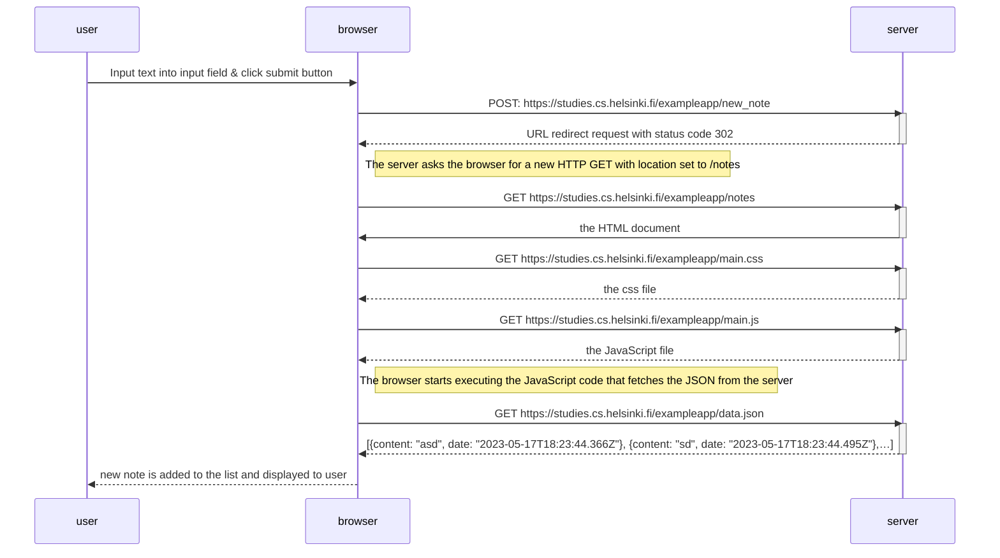

# Chart of user submitting new note

```mermaid
sequenceDiagram
    participant user
    participant browser
    participant server

    user->>browser: Input text into input field & click submit button
    browser->>server: POST: https://studies.cs.helsinki.fi/exampleapp/new_note
    activate server
    server-->> browser: URL redirect request with status code 302
    deactivate server

    Note right of browser: The server asks the browser for a new HTTP GET with location set to /notes

    browser->>server: GET https://studies.cs.helsinki.fi/exampleapp/notes
    activate server
    server->>browser: the HTML document
    deactivate server

    browser->>server: GET https://studies.cs.helsinki.fi/exampleapp/main.css
    activate server
    server-->>browser: the css file
    deactivate server

    browser->>server: GET https://studies.cs.helsinki.fi/exampleapp/main.js
    activate server
    server-->>browser: the JavaScript file
    deactivate server

    Note right of browser: The browser starts executing the JavaScript code that fetches the JSON from the server

    browser->>server: GET https://studies.cs.helsinki.fi/exampleapp/data.json
    activate server
    server-->>browser: [{content: "asd", date: "2023-05-17T18:23:44.366Z"}, {content: "sd", date: "2023-05-17T18:23:44.495Z"},…]
    deactivate server

    browser-->>user: new note is added to the list and displayed to user

```