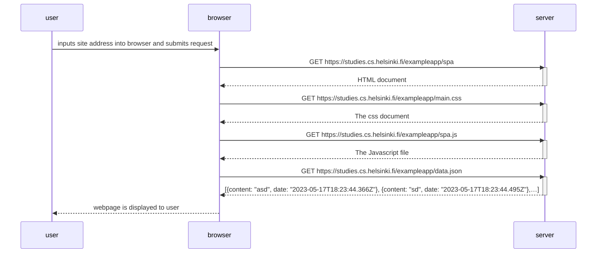

# Chart displaying the user navigating to the SPA ver of notes

```mermaid
sequenceDiagram
participant user
participant browser
participant server

user->>browser: inputs site address into browser and submits request
browser->>server: GET https://studies.cs.helsinki.fi/exampleapp/spa
activate server
server-->>browser: HTML document
deactivate server

browser->>server: GET https://studies.cs.helsinki.fi/exampleapp/main.css
activate server
server-->>browser: The css document
deactivate server

browser->>server: GET https://studies.cs.helsinki.fi/exampleapp/spa.js
activate server
server-->>browser: The Javascript file
deactivate server

browser->>server: GET https://studies.cs.helsinki.fi/exampleapp/data.json
activate server
server-->>browser: [{content: "asd", date: "2023-05-17T18:23:44.366Z"}, {content: "sd", date: "2023-05-17T18:23:44.495Z"},…]
deactivate server

browser-->>user:webpage is displayed to user

```