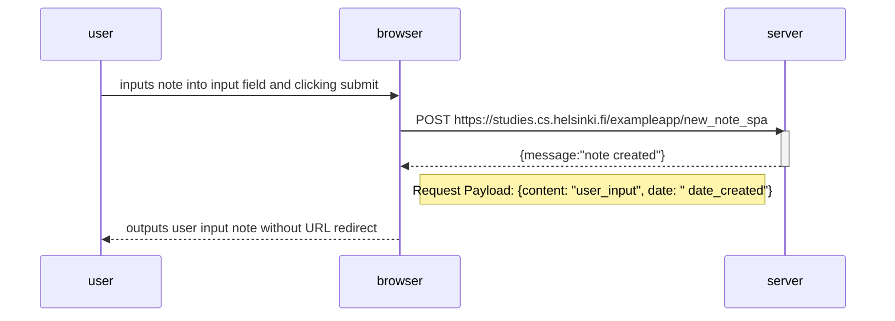

# Chart displaying event of user creating a new note on the SPA version

```mermaid
sequenceDiagram
participant user
participant browser
participant server

user->>browser: inputs note into input field and clicking submit

browser->>server: POST https://studies.cs.helsinki.fi/exampleapp/new_note_spa
activate server
server-->>browser: {message:"note created"}
deactivate server
note right of browser: Request Payload: {content: "user_input", date: " date_created"}

browser-->>user: outputs user input note without URL redirect
```